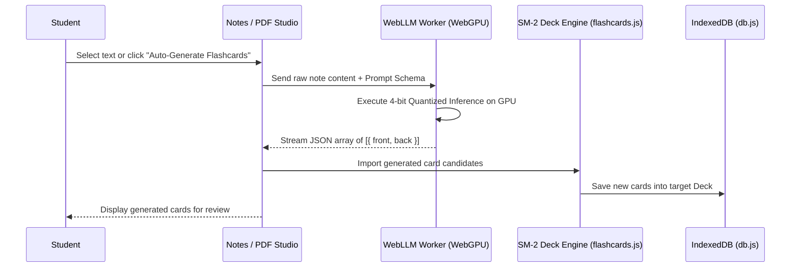
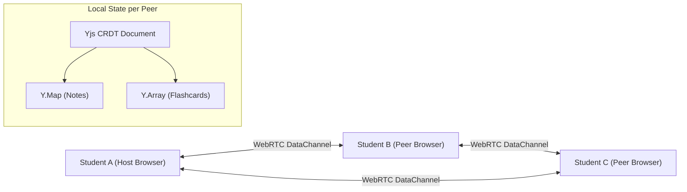

# OpenCourseDeck 10x Architecture & Future Transformation Blueprint (`10X_ARCHITECTURE_TRANSFORMATION.md`)

**Date:** July 25, 2026  
**Status:** Architectural Blueprint & Implementation Specification  
**Target Project:** OpenCourseDeck (`Farzan Learning Studio`)

---

## Executive Overview
This document specifies the technical design, data structures, protocol flows, and implementation contracts for the 6 primary 10x transformation horizons designed to elevate OpenCourseDeck from a client-side learning studio to an industry-leading, AI-native, peer-to-peer collaborative learning platform.

---

## 1. Horizon 1: Local In-Browser WebLLM Auto-Generation (Wasm/WebGPU)

### Overview
Run quantized LLMs (e.g. Llama-3-8B-Instruct, Phi-3-mini, or Qwen-2.5-Coder-3B) directly inside the browser using WebGPU and WebAssembly (via `@mlc-ai/web-llm`). Enables automatic card creation from notes and textbook PDFs without API costs, latency, or data privacy risks.

### Architecture & Data Flow


### Technical Specification
- **Library Target**: `@mlc-ai/web-llm`
- **Model Preset**: `Llama-3.2-3B-Instruct-q4f16_1-MLC` (Model footprint ~1.8 GB stored in CacheStorage).
- **Structured Output Schema**:
```json
{
  "$schema": "http://json-schema.org/draft-07/schema#",
  "type": "array",
  "items": {
    "type": "object",
    "properties": {
      "front": { "type": "string", "maxLength": 280 },
      "back": { "type": "string", "maxLength": 500 },
      "tags": { "type": "array", "items": { "type": "string" } }
    },
    "required": ["front", "back"]
  }
}
```

---

## 2. Horizon 2: Real-Time Peer-to-Peer Multiplayer Study Rooms (WebRTC + CRDTs)

### Overview
Connect students in real-time study rooms without central backend servers using WebRTC data channels and conflict-free replicated data types (CRDTs via `Yjs` or `Automerge`).

### Architecture & Synchronization


### Technical Specification
- **Signaling Server**: Lightweight WebSocket signaling relay (or serverless WebRTC signaling worker) used strictly for SDP offer/answer exchange.
- **CRDT Engine**: `Yjs` with `y-webrtc` provider.
- **State Merging**: Concurrent card additions, edits, and rating updates automatically resolve without merge conflicts.

---

## 3. Horizon 3: Native Anki `.apkg` Deck Interoperability (SQLite Wasm)

### Overview
Full binary compatibility with the Anki ecosystem via in-browser SQLite WebAssembly (`@sqlite.org/sqlite-wasm` / `sql.js`) and ZIP archive extraction (`JSZip`).

### Import / Export Pipeline
- **Import**:
  1. User drops `.apkg` file onto Flashcard Studio.
  2. `JSZip` extracts `collection.anki2` (SQLite db) and media files.
  3. `sql.js` queries `cards`, `notes`, and `col` tables.
  4. Cards converted to `OpenCourseDeck` JSON schema and stored in IndexedDB.
- **Export**:
  1. Query active deck cards from IndexedDB.
  2. Instantiate in-memory SQLite database via `sql.js`.
  3. Create Anki schema (`col`, `notes`, `cards`).
  4. Zip database + media manifest into `.apkg` download blob.

---

## 4. Horizon 4: Zero-Trust Storage Encryption at Rest (Web Crypto AES-256-GCM)

### Overview
Encrypt all IndexedDB stores (`db.js`) and local storage items using user passphrase-derived cryptographic keys.

### Cryptographic Protocol
- **Key Derivation**: `PBKDF2` with HMAC-SHA-256, 600,000 iterations, 128-bit random salt.
- **Cipher**: `AES-256-GCM` with random 96-bit IV per stored entry.
- **Key Storage**: Symmetric key resides exclusively in volatile memory; cleared on tab unload.

---

## 5. Horizon 5: PWA Background Synchronization & Service Worker Cache (`sw.js`)

### Overview
Offline-first Progressive Web App capability powered by Workbox precaching and Background Sync API.

### Precaching Manifest & Strategy
- **Static Assets**: HTML, CSS, vendor scripts precached with `StaleWhileRevalidate`.
- **Media & Fonts**: Cached with `CacheFirst` strategy (30-day expiration window).
- **Background Sync**: Failed API requests / cloud sync payloads queued in IndexedDB and re-sent when internet connection recovers.

---

## 6. Horizon 6: Real-Time Telemetry & Performance Profiling

### Overview
Zero-overhead client-side performance monitoring tracking Core Web Vitals (LCP, INP, CLS), WebGL frame rates (FPS), and IndexedDB transaction latencies.

### Telemetry Specs
- **FPS Monitor**: Calculates rolling 60-frame average in `laser.js` loop; degrades shader quality if FPS drops below 30.
- **Transaction Logger**: Measures IndexedDB read/write latencies; emits warnings if query execution exceeds 50ms.
